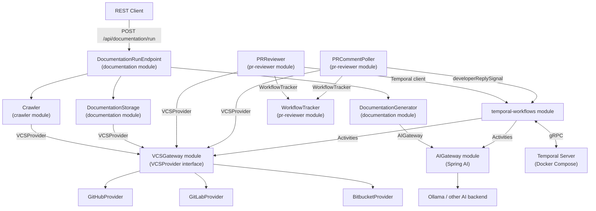

# Design Document: GitHub Repo Documenter

## Overview

The GitHub Repo Documenter is a Spring Boot modular monolith that automates repository documentation and pull request review. It crawls a target repository hosted on any supported VCS provider (GitHub, GitLab, Bitbucket), generates AI-powered Markdown documentation for each source file, stores the output in a dedicated companion repository, and runs an autonomous AI-driven PR review loop via Temporal workflows.

The system is designed around three core concerns:

1. **Documentation pipeline** — triggered on demand via `POST /api/documentation/run`, crawls the repo, generates docs with Spring AI, and pushes results to the companion repo.
2. **Autonomous PR review loop** — a durable Temporal workflow that, when a PR is raised, scans relevant documentation, decides whether it can update docs autonomously or needs developer input, conducts an open-ended multi-turn conversation if needed, then updates documentation and approves the PR.
3. **Provider abstraction** — a `VCSProvider` interface decouples all VCS operations from core logic, enabling GitHub, GitLab, and Bitbucket support without changes to business logic.

Spring AI with Ollama is used as the AI backend during testing. All prompts are managed as `.st` (StringTemplate) files on the classpath — no prompt strings are hardcoded in Java.

---

## Architecture

The application is a single deployable Spring Boot JAR composed of six internal modules. Temporal runs as a sidecar via Docker Compose.



### Module Dependency Rules

| Module | May depend on |
|---|---|
| `crawler` | `vcs-gateway` |
| `documentation` | `ai-gateway`, `vcs-gateway` |
| `pr-reviewer` | `vcs-gateway`, `temporal-workflows` |
| `temporal-workflows` | `vcs-gateway`, `ai-gateway` |
| `ai-gateway` | (none — external only) |
| `vcs-gateway` | (none — external only) |

No module may depend on a concrete provider implementation class directly; all VCS access goes through `VCSProvider`.


---

## Components and Interfaces

### VCSGateway Module

**`VCSProvider` interface** — the central abstraction for all VCS operations:

```java
public interface VCSProvider {
    List<TreeEntry> fetchFileTree(String owner, String repo, String ref);
    String fetchFileContent(String owner, String repo, String path, String ref);
    List<PullRequest> listOpenPullRequests(String owner, String repo);
    PullRequestDiff fetchPullRequestDiff(String owner, String repo, int prNumber);
    void postPullRequestComment(String owner, String repo, int prNumber, PullRequestComment comment);
    List<PullRequestComment> listPullRequestComments(String owner, String repo, int prNumber);
    void approvePullRequest(String owner, String repo, int prNumber);
    void createRepository(String owner, String repoName, boolean isPrivate);
    void pushFile(String owner, String repo, String path, String content, String commitMessage);
}
```

Concrete implementations: `GitHubProvider`, `GitLabProvider`, `BitbucketProvider`. Each reads its PAT from configuration (`vcs.github.token`, `vcs.gitlab.token`, `vcs.bitbucket.token`). Provider selection is driven by `vcs.provider` in `application.yml`; a `VCSProviderFactory` bean resolves the correct implementation at startup.

**Rate-limit handling is provider-owned.** Each concrete implementation catches its provider-specific rate-limit response (GitHub: HTTP 429 + `X-RateLimit-Reset`; GitLab: HTTP 429 + `RateLimit-Reset`; Bitbucket: HTTP 429 + `Retry-After`) and sleeps for the indicated duration before retrying. Callers never see rate-limit errors.

### AIGateway Module

**`AIGateway` interface** — wraps Spring AI and exposes domain-oriented methods:

```java
public interface AIGateway {
    String generateDocumentation(String fileContent, String filePath);
    String generateRepositoryReadme(List<String> fileSummaries, String repoName);
    RelevanceScanResult scanRelevantDocs(String diffPatch, List<DocFileSummary> allDocFiles);
    ReviewDecision analyseAndDecide(String diffPatch, List<DocFileContent> relevantDocs, List<ConversationTurn> history);
    String generateUpdatedDocContent(String originalContent, String diffPatch, List<ConversationTurn> history);
}
```

`ReviewDecision` is a sealed type with two variants: `Autonomous(List<DocUpdate> updates)` and `NeedsInput(String question)`.

The `SpringAIGateway` implementation loads all prompts from `.st` files via Spring AI's `PromptTemplate`. Ollama is configured via `spring.ai.ollama.*` properties.

### Crawler Module

**`RepositoryCrawler`** — orchestrates file tree fetch and content retrieval:

- Reads `crawler.include-extensions` and `crawler.exclude-extensions` from config.
- Skips submodule entries (type `commit` in the tree API).
- On VCS API error for a single file: logs and continues.
- Rate-limit handling is delegated to the VCSProvider implementation.

### Documentation Module

**`DocumentationGenerator`** — generates per-file docs and top-level README:

- Calls `AIGateway.generateDocumentation()` per file; retries up to 3× with exponential backoff (1s, 2s, 4s) on failure.
- Produces a `DocumentationArtifact` per file, including a `shortDescription` field (one sentence) used by the RelevanceScanner.
- After all files processed, calls `AIGateway.generateRepositoryReadme()`.

**`DocumentationStorage`** — pushes docs to the companion repo:

- Companion repo name: `{original_repo_name}_ai_documentation`.
- Creates the repo if it does not exist.
- Mirrors directory structure; overwrites existing files.
- Logs errors with file path and HTTP status on push failure.

**`DocumentationRunEndpoint`** — REST controller:

- `POST /api/documentation/run` — starts the pipeline asynchronously, returns HTTP 202 with a `runId`.
- `GET /api/documentation/run/{runId}/status` — returns current `RunStatus` and summary message.
- Returns 409 if a run is already in progress (tracked via `AtomicReference<DocumentationRun>`).
- Returns 400 if repository configuration is missing/invalid.

### PR Reviewer Module

**`PRReviewer`** — scheduled component that detects new PRs:

- Polls `VCSProvider.listOpenPullRequests()` on `polling.interval-seconds` schedule.
- For each open PR not already in the `WorkflowTracker`, fetches the diff and starts a `PRReviewWorkflow` via the Temporal client using workflow ID `pr-review-{owner}-{repo}-{prNumber}`.
- Registers the PR and workflow ID in the `WorkflowTracker`.
- On PR close/merge, removes the entry from the `WorkflowTracker`.

**`WorkflowTracker`** — in-memory registry (thread-safe `ConcurrentHashMap`):

```java
// key: "{owner}/{repo}/pr/{prNumber}"  value: workflowId
public class WorkflowTracker {
    void register(String owner, String repo, int prNumber, String workflowId);
    Optional<String> findWorkflowId(String owner, String repo, int prNumber);
    void remove(String owner, String repo, int prNumber);
    Set<TrackedPR> allTracked();
}
```

**`PRCommentPoller`** — scheduled polling component:

- Runs on `polling.interval-seconds` schedule.
- For each PR in the `WorkflowTracker`, calls `VCSProvider.listPullRequestComments()`.
- Identifies new comments (ID greater than the last-seen comment ID for that PR) whose `author` does not equal `vcs.bot-username`.
- Sends a `developerReplySignal` carrying the comment body to the corresponding workflow.
- On signal delivery failure (workflow not found / already completed): logs warning and removes the PR from the `WorkflowTracker`.


### Temporal Workflows Module

**`PRReviewWorkflow`** interface and `PRReviewWorkflowImpl` — the autonomous review loop:

```
1. ScanRelevantDocsActivity
      Walk doc file tree; read each file's shortDescription;
      return list of relevant doc file paths.

2. AnalyseDiffActivity
      Read full content of each relevant doc file + PR diff + conversation history.
      Call AIGateway.analyseAndDecide().
      Returns ReviewDecision.

3a. If ReviewDecision == Autonomous:
      UpdateDocumentationActivity  (push updated doc files)
      ApprovePRActivity            (approve the PR)
      → workflow completes

3b. If ReviewDecision == NeedsInput:
      PostCommentActivity          (post question to PR)
      Workflow.await(timeout, developerReplyReceived)
      On reply: append to conversation history → go to step 2
      On timeout: TimeoutActivity (post no-response comment) → workflow completes
```

The conversation history (`List<ConversationTurn>`) is held in workflow state and passed to every `AnalyseDiffActivity` call, so the ReviewAgent always has full context. There is no fixed limit on the number of turns — the loop continues until the ReviewAgent is satisfied or a timeout fires.

**Activities**:

| Activity | Inputs | Behaviour |
|---|---|---|
| `ScanRelevantDocsActivity` | `diffPatch`, `List<DocFileSummary>` | Calls `AIGateway.scanRelevantDocs()`; returns relevant file paths |
| `AnalyseDiffActivity` | `diffPatch`, relevant doc contents, conversation history | Calls `AIGateway.analyseAndDecide()`; returns `ReviewDecision` |
| `PostCommentActivity` | PR coords, question text | Posts comment via `VCSProvider` |
| `UpdateDocumentationActivity` | `List<DocUpdate>` (path + new content) | Calls `VCSProvider.pushFile()` for each update |
| `ApprovePRActivity` | PR coords | Calls `VCSProvider.approvePullRequest()` |
| `TimeoutActivity` | PR coords, last question asked | Posts timeout follow-up comment via `VCSProvider` |

**Retry policy** (default for all activities): initial interval 1s, backoff coefficient 2.0, max attempts 3.

---

## Data Models

### Domain Records

```java
// VCS domain
record TreeEntry(String path, String type, String sha) {} // type: "blob" | "tree" | "commit"
record PullRequest(int number, String title, String headSha, String baseSha) {}
record PullRequestDiff(int prNumber, List<FileDiff> fileDiffs) {}
record FileDiff(String path, String patch) {}
record PullRequestComment(String body, String path, int line, String author, long id) {}

// Documentation domain
record DocumentationArtifact(String sourcePath, String markdownContent, String shortDescription) {}
record DocumentationRun(String runId, String owner, String repo, Instant startedAt, RunStatus status, String summary) {}
enum RunStatus { IN_PROGRESS, COMPLETED, FAILED }
record DocFileSummary(String path, String shortDescription) {}
record DocFileContent(String path, String markdownContent) {}
record DocUpdate(String path, String newContent) {}

// AI gateway domain
sealed interface ReviewDecision {
    record Autonomous(List<DocUpdate> updates) implements ReviewDecision {}
    record NeedsInput(String question) implements ReviewDecision {}
}
record RelevanceScanResult(List<String> relevantPaths) {}

// Workflow domain
record ConversationTurn(String question, String reply) {}
record PRReviewState(
    String owner, String repo, int prNumber,
    String diffPatch,
    List<String> relevantDocPaths,
    List<ConversationTurn> history
) {}

// Workflow tracker domain
record TrackedPR(String owner, String repo, int prNumber, String workflowId, long lastSeenCommentId) {}
```

### Configuration Properties

```yaml
vcs:
  provider: github          # github | gitlab | bitbucket
  bot-username: my-bot-account
  github:
    token: ${VCS_GITHUB_TOKEN}
    api-base-url: https://api.github.com
  gitlab:
    token: ${VCS_GITLAB_TOKEN}
    api-base-url: https://gitlab.com/api/v4
  bitbucket:
    token: ${VCS_BITBUCKET_TOKEN}
    api-base-url: https://api.bitbucket.org/2.0

target-repository:
  owner: my-org
  repo: my-repo
  ref: main

crawler:
  include-extensions: [.java, .kt, .py, .ts, .js, .go]
  exclude-extensions: [.md, .txt]

spring:
  ai:
    ollama:
      base-url: http://localhost:11434
      chat:
        model: llama3

temporal:
  host: localhost
  port: 7233
  namespace: default
  pr-review-workflow:
    signal-timeout-seconds: 86400   # 24 hours default

polling:
  interval-seconds: 60
```

### Prompt Template Files

All located under `src/main/resources/prompts/`:

| File | Purpose |
|---|---|
| `generate-documentation.st` | Per-file documentation generation |
| `generate-readme.st` | Top-level README generation |
| `scan-relevant-docs.st` | RelevanceScanner: identify relevant doc files from diff + summaries |
| `analyse-diff.st` | ReviewAgent: analyse diff vs docs, decide autonomous or ask |
| `pr-timeout-followup.st` | Timeout follow-up comment |

Note: question text for developer clarification is generated dynamically by the ReviewAgent via `analyse-diff.st` — there are no fixed per-turn question templates.


---

## Correctness Properties

*A property is a characteristic or behavior that should hold true across all valid executions of the system.*

### Property 1: Crawler fetches content for every blob in the file tree

*For any* file tree returned by the VCSProvider, the Crawler SHALL call `fetchFileContent` exactly once for each entry of type `blob` that passes the configured extension filter, and the resulting set of fetched paths SHALL equal the set of blob paths in the tree.

**Validates: Requirements 1.1, 1.2**

---

### Property 2: Crawler resilience — partial failures do not abort the run

*For any* file tree where a random subset of files causes the VCSProvider to throw an exception, the Crawler SHALL still return documentation-ready content for all files that did not fail, and the number of successfully fetched files SHALL equal the total blob count minus the number of injected failures.

**Validates: Requirement 1.3**

---

### Property 3: Extension filter is respected

*For any* file tree and any combination of include/exclude extension configuration, every file path returned by the Crawler SHALL match the include list (if non-empty) and SHALL NOT match the exclude list.

**Validates: Requirement 1.5**

---

### Property 4: Submodule entries are never included in crawl results

*For any* file tree containing entries of type `commit` (submodules), the Crawler SHALL not include any of those entries in the returned file content set.

**Validates: Requirement 1.6**

---

### Property 5: Documentation is generated for every crawled file

*For any* non-empty list of source files produced by the Crawler, the DocumentationGenerator SHALL produce a `DocumentationArtifact` for each file, and the set of artifact source paths SHALL equal the set of input file paths.

**Validates: Requirement 2.1**

---

### Property 6: Generated documentation output is non-empty Markdown with a short description

*For any* source file content passed to the DocumentationGenerator, the resulting `DocumentationArtifact.markdownContent` SHALL be a non-empty string containing at least one Markdown heading (`#`), and `DocumentationArtifact.shortDescription` SHALL be a non-empty, non-null string.

**Validates: Requirements 2.4, 2.8**

---

### Property 7: All documentation artifacts are pushed to the companion repo

*For any* list of `DocumentationArtifact` objects produced by the DocumentationGenerator, the DocumentationStorage component SHALL call `VCSProvider.pushFile` exactly once for each artifact, and the set of pushed paths SHALL equal the set of artifact source paths (with `.md` extension).

**Validates: Requirement 3.1**

---

### Property 8: Directory structure is mirrored in the companion repo

*For any* source file at path `a/b/c.java`, the corresponding documentation file SHALL be pushed to path `a/b/c.java.md` in the companion repo, preserving the full directory hierarchy.

**Validates: Requirement 3.3**

---

### Property 9: Documentation push is idempotent

*For any* `DocumentationArtifact`, pushing it to the companion repo twice SHALL result in the companion repo containing the content from the second push, and `pushFile` SHALL be called with the new content on the second invocation (overwrite semantics).

**Validates: Requirement 3.4**

---

### Property 10: PRReviewer starts a workflow for every new open PR not already tracked

*For any* list of open PRs returned by the VCSProvider where a random subset are already in the WorkflowTracker, the PRReviewer SHALL start exactly one `PRReviewWorkflow` for each PR not already tracked, and SHALL NOT start a workflow for any PR already in the WorkflowTracker.

**Validates: Requirements 4.2, 4.5**

---

### Property 11: WorkflowTracker registers and deregisters entries correctly

*For any* sequence of register and remove operations on the WorkflowTracker, `findWorkflowId` SHALL return the registered workflow ID for any PR that has been registered and not yet removed, and SHALL return empty for any PR that has been removed or never registered.

**Validates: Requirement 4.3, 4.4**

---

### Property 12: PRReviewWorkflow reaches autonomous completion when ReviewAgent is satisfied immediately

*For any* PR diff and relevant doc set where the mocked ReviewAgent always returns `Autonomous`, the PRReviewWorkflow SHALL call `UpdateDocumentationActivity` and `ApprovePRActivity` exactly once each and SHALL complete without posting any questions.

**Validates: Requirements 5.2, 5.3**

---

### Property 13: PRReviewWorkflow conducts multi-turn conversation until ReviewAgent is satisfied

*For any* scenario where the mocked ReviewAgent returns `NeedsInput` for the first N turns and then `Autonomous` on turn N+1, the PRReviewWorkflow SHALL post exactly N questions, receive N developer-reply Signals, then call `UpdateDocumentationActivity` and `ApprovePRActivity` and complete.

**Validates: Requirements 5.4–5.7**

---

### Property 14: Conversation history is complete and ordered

*For any* multi-turn conversation, the `List<ConversationTurn>` passed to `AnalyseDiffActivity` on turn K SHALL contain exactly K-1 entries, each entry containing the question posted and the developer reply received for that turn, in chronological order.

**Validates: Requirement 5.8**

---

### Property 15: Poller sends a signal for every new developer reply

*For any* set of PR comments where a random subset are new developer replies (author ≠ bot-username, ID > last-seen ID), the PRCommentPoller SHALL send exactly one `developerReplySignal` to the corresponding workflow instance for each new developer reply detected.

**Validates: Requirement 6.3**

---

### Property 16: Poller does not send duplicate signals

*For any* polling cycle where no new comments have appeared since the last cycle, the PRCommentPoller SHALL send zero signals.

**Validates: Requirement 6.4**

---

### Property 17: PRReviewWorkflow is idempotent on duplicate start

*For any* workflow ID `pr-review-{owner}-{repo}-{prNumber}`, starting a `PRReviewWorkflow` with that ID when an instance already exists SHALL not create a second workflow instance; the Temporal client SHALL receive a `WorkflowExecutionAlreadyStarted` response and the existing workflow SHALL continue unaffected.

**Validates: Requirement 5.14**

---

### Property 18: VCS provider API responses are correctly mapped to domain objects

*For any* valid API response from any of the three VCS providers (GitHub, GitLab, Bitbucket), the provider implementation SHALL produce a domain object whose fields exactly match the values present in the API response, regardless of provider-specific field naming differences.

**Validates: Requirements 8.2, 8.3, 8.4**

---

### Property 19: All VCS API requests carry the configured PAT

*For any* method call on any concrete `VCSProvider` implementation, the outgoing HTTP request SHALL include an `Authorization` header containing the PAT read from the corresponding provider's configuration property.

**Validates: Requirement 8.11**


---

## Error Handling

### VCS API Errors

| Scenario | Behavior |
|---|---|
| File fetch fails (non-rate-limit) | Log error with file path; continue to next file |
| Rate-limit response | Handled inside VCSProvider implementation; caller retried transparently |
| Push file fails | Log error with file path and HTTP status; continue |
| List PRs fails | Log error; skip that polling cycle |
| Post comment fails | Log error with PR number; continue |
| Approve PR fails | Activity retried per retry policy; workflow fails after max retries |
| Create repo fails | Propagate exception; fail the documentation run |

### AI Provider Errors

| Scenario | Behavior |
|---|---|
| AI call fails or times out | Retry up to 3× with exponential backoff (1s, 2s, 4s) |
| All retries exhausted | Log failure with file path; skip file; continue |
| AI config missing at startup | Fail fast with descriptive error message |

### Temporal Activity Errors

All activities use a default retry policy: initial interval 1s, backoff coefficient 2.0, max attempts 3. After exhausting retries, the activity failure propagates to the workflow, which marks itself as failed.

### Startup Validation

The application performs eager validation of required configuration at startup:
- `vcs.provider` must be one of `github`, `gitlab`, `bitbucket` — fail fast otherwise.
- `vcs.bot-username` must be present — fail fast otherwise.
- The selected provider's PAT must be present — fail fast otherwise.
- `spring.ai.*` configuration must be present and valid — fail fast otherwise.

### Documentation Run Concurrency

An `AtomicReference<DocumentationRun>` tracks the current run. If a run is `IN_PROGRESS` when `POST /api/documentation/run` is called, the endpoint returns HTTP 409 immediately. The run transitions to `COMPLETED` or `FAILED` when the async pipeline finishes.

---

## Testing Strategy

### Dual Testing Approach

- **Unit/example tests** verify specific behaviors, state transitions, error conditions, and integration wiring.
- **Property-based tests** verify universal invariants across randomly generated inputs.

### Property-Based Testing

**Library**: [jqwik](https://jqwik.net/) (integrates with JUnit 5).

Each property-based test MUST:
- Run a minimum of **100 iterations** (`@Property(tries = 100)`).
- Include a comment: `// Feature: github-repo-documenter, Property N: <property_text>`

**Property test mapping**:

| Design Property | Test class | jqwik `@Property` method |
|---|---|---|
| Property 1 | `CrawlerPropertyTest` | `crawlerFetchesContentForEveryBlob` |
| Property 2 | `CrawlerPropertyTest` | `partialFailuresDoNotAbortCrawl` |
| Property 3 | `CrawlerPropertyTest` | `extensionFilterIsRespected` |
| Property 4 | `CrawlerPropertyTest` | `submoduleEntriesAreNeverIncluded` |
| Property 5 | `DocumentationGeneratorPropertyTest` | `documentationGeneratedForEveryFile` |
| Property 6 | `DocumentationGeneratorPropertyTest` | `generatedOutputIsNonEmptyMarkdownWithDescription` |
| Property 7 | `DocumentationStoragePropertyTest` | `allArtifactsArePushed` |
| Property 8 | `DocumentationStoragePropertyTest` | `directoryStructureIsMirrored` |
| Property 9 | `DocumentationStoragePropertyTest` | `pushIsIdempotent` |
| Property 10 | `PRReviewerPropertyTest` | `workflowStartedForEveryUntrackedPR` |
| Property 11 | `WorkflowTrackerPropertyTest` | `trackerRegistersAndDeregistersCorrectly` |
| Property 12 | `PRReviewWorkflowPropertyTest` | `autonomousCompletionWhenAgentSatisfiedImmediately` |
| Property 13 | `PRReviewWorkflowPropertyTest` | `multiTurnConversationUntilAgentSatisfied` |
| Property 14 | `PRReviewWorkflowPropertyTest` | `conversationHistoryIsCompleteAndOrdered` |
| Property 15 | `PRCommentPollerPropertyTest` | `signalSentForEveryNewDeveloperReply` |
| Property 16 | `PRCommentPollerPropertyTest` | `noDuplicateSignalsOnNoNewComments` |
| Property 17 | `PRReviewWorkflowPropertyTest` | `workflowStartIsIdempotent` |
| Property 18 | `VCSProviderPropertyTest` | `apiResponsesMappedCorrectlyToDomainObjects` |
| Property 19 | `VCSProviderPropertyTest` | `allRequestsCarryConfiguredPAT` |

### Unit / Example Tests

**Crawler**: rate-limit delegation to VCSProvider; submodule skip with warning log; extension filter include-only and exclude-only.

**DocumentationGenerator**: retry on AI failure (3 failures → skip + log); README generation called after all files; `shortDescription` field populated; prompt templates render correctly.

**DocumentationStorage**: repo creation when not exists; push failure logged with path and HTTP status.

**PRReviewer**: no workflow started for PR already in WorkflowTracker; WorkflowTracker updated on PR close.

**WorkflowTracker**: register, find, remove, allTracked operations; thread-safety under concurrent access.

**PRCommentPoller**: new reply (non-bot, new ID) → signal sent to correct workflow; bot comment → no signal; already-seen comment → no signal; signal to completed workflow → warning logged + PR removed from tracker.

**Temporal Workflow (using `TestWorkflowEnvironment`)**:
- Autonomous path: mocked ReviewAgent returns `Autonomous` → `UpdateDocumentationActivity` + `ApprovePRActivity` called, no questions posted.
- Single-turn clarification: `NeedsInput` then `Autonomous` → one question posted, one signal sent, then docs updated and PR approved.
- Multi-turn clarification: `NeedsInput` × N then `Autonomous` → N questions posted, docs updated and PR approved.
- Timeout: advance time past `signal-timeout-seconds` → `TimeoutActivity` called, workflow completes without updating docs or approving PR.
- Activity retry: mock activity failure → verify retry up to configured max.

**Activity unit tests** (mocked `VCSProvider` and `AIGateway`):
- `ScanRelevantDocsActivity`: correct doc summaries passed to AIGateway; relevant paths returned.
- `AnalyseDiffActivity`: diff + doc contents + history passed to AIGateway; `ReviewDecision` returned.
- `PostCommentActivity`: correct comment body posted to correct PR.
- `UpdateDocumentationActivity`: `pushFile` called once per `DocUpdate`.
- `ApprovePRActivity`: `approvePullRequest` called with correct PR coords.
- `TimeoutActivity`: timeout comment posted with correct template.

**VCS Provider**: correct provider instantiated for each `vcs.provider` value; invalid value → startup failure; missing PAT → startup failure; missing `bot-username` → startup failure.

**Prompt Templates**: all five `.st` files loadable from classpath; rendered output contains expected variable substitutions.

**DocumentationRunEndpoint**: HTTP 202 + runId on valid config; HTTP 400 on missing config; HTTP 409 on concurrent call; status endpoint returns `IN_PROGRESS`, `COMPLETED`, `FAILED` correctly.

### Test Infrastructure

- All external dependencies (VCS API, AI provider, Temporal server) are mocked in unit tests — no real network calls.
- Temporal workflow tests use `TestWorkflowEnvironment` with `TestActivityEnvironment` for activity isolation.
- Spring context tests use `@SpringBootTest` with `@MockBean` for integration-level wiring tests.
- Property tests use jqwik `@Provide` methods to generate random `TreeEntry` lists, `FileDiff` objects, `PullRequest` lists, comment sets, and `ConversationTurn` sequences.
